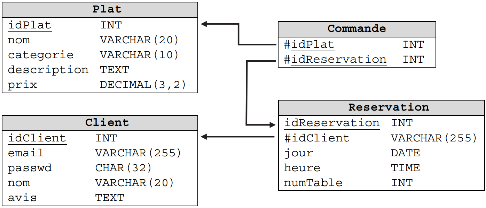

# cour 01 : intoduction à SQL et installation 


## 1.Introduction :

- SQL (Structured Query Language) est un langage de programmation conçu pour gérer, manipuler et interroger des bases de données relationnelles. 

- Les bases de données relationnelles stockent des données sous forme de tables, ce qui permet une gestion structurée des informations. 

- SQL est utilisé dans une grande variété d'applications, de la gestion de bases de données d'entreprise à la gestion de données personnelles.

### a.Principaux concepts SQL:


1. **Bases de données** : Une base de données est une collection organisée de données. Chaque base de données peut contenir plusieurs tables.

2. **Tables** : Les tables sont des structures de données rectangulaires qui stockent les informations. Chaque table est composée de colonnes (champs) et de lignes (enregistrements).

3. **Requêtes** : Les requêtes SQL permettent d'extraire, de mettre à jour, d'insérer ou de supprimer des données dans une base de données. Une requête est un ensemble d'instructions SQL.

4. **CRUD** : CRUD est un acronyme qui signifie Create (Créer), Read (Lire), Update (Mettre à jour) et Delete (Supprimer). Ces opérations de base sont effectuées sur les données à l'aide de SQL.

5. **Contraintes** : Les contraintes sont des règles définies sur les données pour garantir l'intégrité et la cohérence des données. Par exemple, une contrainte d'intégrité référentielle peut être utilisée pour assurer l'intégrité des relations entre les tables.


### b. SGBD et  SQL  :

- Un SGBD, ou Système de Gestion de Base de Données, est un logiciel conçu pour gérer efficacement le stockage, la récupération, la modification et la manipulation de données dans une base de données. Il agit comme une interface entre les utilisateurs ou les applications et les données stockées dans la base de données. Les SGBD sont des outils essentiels dans le domaine de la gestion de données, car ils permettent d'organiser, de sécuriser et d'accéder aux informations de manière efficace.

Voici quelques caractéristiques importantes d'un SGBD :

1. **Stockage des données** : Un SGBD stocke les données de manière structurée dans des tables, des relations ou d'autres structures spécifiques, en fonction du modèle de données choisi (relationnel, document, graphe, etc.).

2. **Sécurité des données** : Les SGBD offrent des mécanismes de sécurité pour protéger les données contre l'accès non autorisé. Cela comprend l'authentification, l'autorisation et le cryptage des données sensibles.

3. **Gestion de la concurrence** : Ils gèrent la concurrence lorsque plusieurs utilisateurs ou applications tentent d'accéder ou de modifier simultanément les données.

4. **Optimisation des requêtes** : Les SGBD sont capables d'optimiser les requêtes pour récupérer les données de manière efficace, en minimisant le temps de réponse.

5. **Intégrité des données** : Ils garantissent l'intégrité des données en appliquant des contraintes et des règles prédéfinies pour éviter les données incorrectes ou incohérentes.

- SQL (Structured Query Language) est un langage de programmation spécialement conçu pour interagir avec les SGBD relationnels. SQL permet aux utilisateurs de communiquer avec le SGBD en écrivant des requêtes pour effectuer diverses opérations sur les données stockées. Ces opérations SQL de base sont généralement regroupées sous l'acronyme CRUD. 

#### Exemples de SGBDR :

Il existe de nombreux SGBDR (Systèmes de Gestion de Bases de Données Relationnelles) disponibles, chacun ayant ses propres caractéristiques et avantages. Voici quelques exemples populaires de SGBDR :

1. **MySQL** : MySQL est un SGBDR open source largement utilisé. Il est connu pour sa rapidité, sa fiabilité et sa compatibilité avec de nombreuses applications web. MySQL est utilisé par de nombreuses entreprises et est un choix populaire pour les sites web dynamiques et les applications.

2. **Oracle Database** : Oracle Database est un SGBDR développé par Oracle Corporation. Il est robuste, évolutif et largement utilisé dans les entreprises pour les applications de base de données critiques.

3. **Microsoft SQL Server** : Microsoft SQL Server est un SGBDR développé par Microsoft. Il est principalement utilisé dans l'écosystème Microsoft, mais il est également pris en charge sur d'autres plates-formes. SQL Server est couramment utilisé pour les applications d'entreprise.

4. **PostgreSQL** : PostgreSQL est un SGBDR open source avec un fort accent sur la conformité aux normes SQL, la flexibilité et l'extensibilité. Il est apprécié pour sa robustesse et est utilisé dans diverses applications, y compris les applications web.

5. **SQLite** : SQLite est un SGBDR embarqué qui fonctionne sans serveur distinct. Il est léger, rapide et largement utilisé dans les applications mobiles, les navigateurs web et d'autres applications embarquées.


### c. Modéle Relationnel :

Un modèle relationnel est un modèle de données utilisé en informatique pour structurer et organiser les données dans une base de données relationnelle. Il  est aussi le modèle de données le plus couramment utilisé dans les systèmes de gestion de bases de données relationnelles (SGBDR).

Le modèle relationnel repose sur le concept de tables, de relations et de tuples (lignes de données), et il est basé sur la théorie des ensembles mathématiques. Voici quelques concepts clés du modèle relationnel :

1. **Table** : Une table est une structure rectangulaire qui stocke des données. Chaque table a un nom et est composée de colonnes (champs) et de lignes (tuples). Chaque colonne a un nom et un type de données associé, tandis que chaque ligne contient une série de valeurs pour ces colonnes.

2. **Relation** : Une relation est un ensemble de données stockées dans une table. Elle est souvent associée à un domaine d'application spécifique et représente une entité ou un concept du monde réel. Par exemple, une table "Clients" peut représenter la relation des clients d'une entreprise.

3. **Tuple** : Un tuple est une ligne individuelle dans une table, et il représente une occurrence spécifique de la relation. Chaque tuple contient des données qui correspondent aux colonnes de la table.

4. **Attribut** : Un attribut est une colonne d'une table, et il représente une propriété particulière de la relation. Par exemple, une table "Produits" peut avoir des attributs tels que "Nom du produit", "Prix", "Stock", etc.

5. **Clé primaire** : Une clé primaire est une ou plusieurs colonnes qui identifient de manière unique chaque tuple dans une table. Elle garantit que chaque enregistrement a une valeur d'identification unique.

6. **Clé étrangère** : Une clé étrangère est une colonne dans une table qui établit une relation avec une autre table. Elle est utilisée pour créer des liens entre les données dans différentes tables.


### d. schéma Relationnel :

Un schéma relationnel est une représentation structurelle et conceptuelle de la manière dont les données sont organisées dans une base de données relationnelle. Il définit la structure de la base de données en spécifiant les tables, les colonnes, les clés primaires, les clés étrangères et d'autres contraintes qui régissent les données stockées dans la base de données.

Voici les éléments clés d'un schéma relationnel :

1. **Tables** : Le schéma relationnel répertorie toutes les tables qui composent la base de données. Chaque table représente une relation spécifique et est associée à un nom unique. Par exemple, une base de données d'une librairie peut avoir des tables telles que "Livres", "Auteurs", "Clients", etc.

2. **Colonnes** : Pour chaque table, le schéma spécifie les colonnes qui composent cette table. Chaque colonne a un nom, un type de données (comme texte, nombre entier, date, etc.), et éventuellement d'autres propriétés, telles que la taille maximale pour une colonne de texte.

3. **Clés primaires** : Le schéma identifie les clés primaires de chaque table. Une clé primaire est une ou plusieurs colonnes qui garantissent l'unicité des enregistrements dans la table. Elle permet d'identifier de manière unique chaque tuple (ligne) dans la table.

4. **Clés étrangères** : Si une table est liée à une autre table par le biais d'une relation, le schéma indique les clés étrangères. Une clé étrangère est une colonne qui fait référence à la clé primaire d'une autre table, établissant ainsi une relation entre les deux tables.

5. **Contraintes d'intégrité** : Le schéma peut inclure des contraintes d'intégrité pour garantir que les données respectent certaines règles et conditions. Par exemple, une contrainte peut exiger que les valeurs d'une colonne respectent un format spécifique ou qu'elles ne puissent pas être nulles.

6. **Autres éléments** : En plus de ces éléments de base, le schéma peut également spécifier des vues, des index, des procédures stockées et d'autres objets liés à la gestion des données.


Exemples :




## 2.Installation de SQL sur Unix


### Étapes d'installation de MySQL sur Unix


1. **Mise à jour des packages** : Avant d'installer MySQL, assurez-vous que les informations sur les packages sont à jour en exécutant la commande suivante :
   
   ```bash
   sudo apt-get update
   ```

   

2. **Installation de MySQL** : Utilisez la commande suivante pour installer MySQL :

   ```
   sudo apt-get install mysql-server
   ```

   Suivez les instructions à l'écran pour terminer l'installation. Vous devrez également définir un mot de passe pour l'utilisateur root de MySQL.

4. **Vérification de status** : vous pouvez vérifier si MySQL est en cours d'exécution en utilisant la commande :

   ```
   sudo service mysql status
   ```


5. **Lancer le serveur  MySQL** : Activer le server de MySQL :

   ```
   sudo service mysql start
   ```

6. **Connexion à MySQL :** 

    ```
    sudo mysql 

    // ou :

    mysql -u root -p 

    // pour fermer la conexion utiliser le mot cles : exit     
    ```


7. **Arrater le serveur SQL:**

    ```
    sudo service mysql stop
    ```
